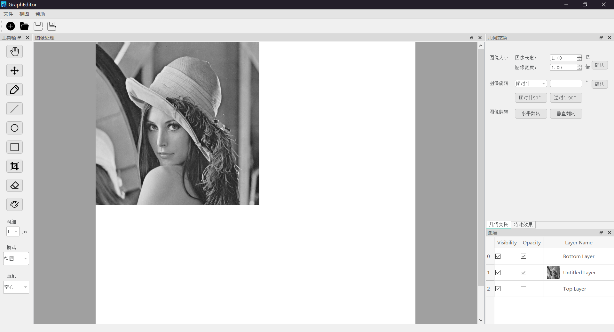
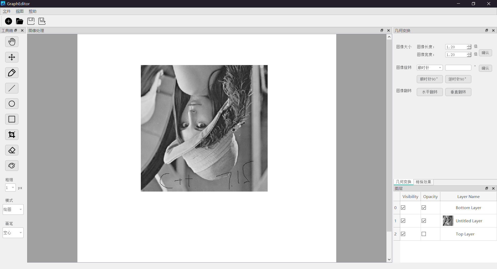

分报告
=========================
# 1.分工任务的解决方案  

我在这个项目中的分工是实现ui界面的显示与并且将图像数据和操作与ui显示相连接，  因此我写了一个基于qt的ui界面。包括了我的队友实现的所有功能，我将他们用按钮和菜单的方式实现与用户的互动。这个过程并不简单，因为在将我的槽与他们提供的信号（signal）函数相连接时，仍然有许多细节要去考虑。除了ui界面之外，我在项目中还负责mvvm模型中viewmodel部分的实现。负责接受用户的信号，将指令传给layertablemodel和layertableview，让两部分进行对应的操作。
# 2.设计思路
## （1）前端UI
在设计时，PhotoStall软件界面被分为三个区域：左右侧的工具栏、中间的画布、上方的菜单，整个软件共划分了五个功能区，包括文件操作、绘图工具、几何变换、特殊效果与图层模块。在实现时同时利用了Qt Designer 工具与QT界面库,主要用到了QdockWidget（停靠区域）、QpushButton（按钮）、QcomboBox（下拉框）、QLabel（标签）等控件。先利用Qt Designer的直观效果进行初步的设计，节省时间，再根据软件运行出来的情况与自身的需求利用QT界面库编写代码，完成Qt Designer所实现不了的效果。为实现可自由组合各功能区布局的效果，我们去除了原有的固定的屏幕中心Widget，然后将画布dock_paint(QDockWidget)设置为中心区域（运行时仍可移动）；为实现各功能区适应软件窗口大小，我们设置了不同的最小宽高与最大宽高。每个功能区内的各个控件的排版则利用Qt Designer中的拖动与设置实现，非常方便。为了让软件的界面更美观一些，我们利用Qt的QSS文件对一些控件进行了部分属性的设置。
## （2）layerdelegate.h
我们还需要定义委托类来进行数据的渲染和编辑，下面是定义委托类LayerDelegate的头文件layerdelegate.h。可以看到，这个头文件实现了对事件的编辑和对数据的渲染和编辑。

      ifndef LAYERDELEGATE_H
      define LAYERDELEGATE_H

      include <QStyledItemDelegate>
      include <QLineEdit>
      include <QDebug>
      include <QPainter>

      class LayerDelegate : public QStyledItemDelegate
      {
       Q_OBJECT

      public:
       LayerDelegate(QObject *parent=nullptr);
       ~LayerDelegate();


       void paint(QPainter * painter, const QStyleOptionViewItem & option, const QModelIndex & index) const;
       QWidget *createEditor(QWidget *parent, const QStyleOptionViewItem &option,
           const QModelIndex &index) const;
       bool editorEvent(QEvent * event,
           QAbstractItemModel * model,
           const QStyleOptionViewItem & option,
           const QModelIndex & index);
       void setEditorData(QWidget *editor, const QModelIndex &index) const;
       void setModelData(QWidget *editor, QAbstractItemModel *model,
           const QModelIndex &index) const;
       void updateEditorGeometry(QWidget *editor,
           const QStyleOptionViewItem &option, const QModelIndex &index) const;

      };
      endif // LAYERDELEGATE_H

每当用户产生一个操作，在这个类中产生一个委托，然后将这个委托传到view层和model层分别进行处理。最后经过调试和反复的使用发现Qt的model/view机制虽然不是c++原生的标准，但也能再GUI编程中达到流畅的运行效果。使用model/view模型让我们相对而言比较方便地实现了独具特色的图形化图层列表功能，也减轻了GUI软件前端开发的工作量。这是我们对Qt框架特性的又一次运用。
## （3）qimagelabel.h
首先为了更好地实现图像窗口对预览图的获取，以及将关于画布的动作捕捉在画布中实现，我们在原有的显示图片所用的QLabel的基础上做了继承，创建了ImageLabel子类，实现了以下的功能。
```
预览图的获取与缩放
鼠标拖动与移动动作的捕捉、键盘动作的捕捉
```
      ifndef IMAGEQLABEL_H
      define IMAGEQLABEL_H
      include<QLabel>
      include<QMouseEvent>
      include<QKeyEvent>
      class ImageQLabel:public QLabel
      {
          Q_OBJECT
      private:
          QPixmap preview_;
          qreal zoom_level_=1.0;
          QPoint clicked_pos;
          QPoint move_pos;
      signals:
          void dragged(QPoint,QPoint);
          void moved(QPoint,QPoint);
      public:
          ImageQLabel();
          ImageQLabel(QWidget *parent);
          void SetPreview(const QPixmap &new_preview);
          void SetZoomLevel(qreal delta_level);
          void ResetZoom();
          void RefreshView();
          qreal GetZoomLevel()const;
          virtual void mousePressEvent(QMouseEvent *event);
          virtual void mouseReleaseEvent(QMouseEvent *event);
          virtual void mouseMoveEvent(QMouseEvent *event);
      };
各个函数的功能从命名上就能清晰的体现出来，不需要太多冗余的注释。其中preview_为当前获取的未缩放的预览图，zoom_level_为缩放等级，两个QPoint类型的成员变量则用来记录鼠标移动的轨迹。<br>
在重新设置预览图时，由于需要获取当前图层渲染的预览图的数据，需要从MainWindow中对ImageLabel和LayerGroup类的成员函数进行直接的调用，MainWindow.cpp中对于用来刷新图像显示的函数定义如下：

      void MainWindow::RefreshView()
      {
          if (layer_group_==nullptr) imgLabel->clear();
          else {
              QImage preview = layer_group_->get_preview();
              imgLabel->SetPreview(QPixmap::fromImage(preview));
              imgLabel->RefreshView();
          }
      }
         
其中ImageLabel的RefreshView函数，实现的是根据当前设置的预览图和缩放比例重新刷新实际显示图像的逻辑。

      void ImageQLabel::RefreshView(){
          if (preview_.isNull()) return ;
          resize(preview_.size()*zoom_level_);
          clear();
          setPixmap(preview_.scaled(preview_.size()*zoom_level_));
      }

对于鼠标动作的捕捉，我们Override了原有的鼠标事件虚函数mousePressEvent、mouseMoveEvent、mouseReleaseEvent，并在其中向外发射dragged信号(signals)和moved信号，将拖动移动坐标信息传到需要使用的其他类的槽函数(slots)之中。

下面，我们需要实现的，就是如何将前端界面按钮和画布与和其功能对应的相关函数链接起来。这里我们主要利用Qt的信号槽机制实现连接。
Qt提供了信号和槽的机制用于完成界面操作的响应，是完成任意两个Qt对象之间的通信机制。
首先，我们在mainwindow.h中声明各个按钮对应的槽：

      private slots:
          void NewFile();
          void OpenFile();
          void SaveFile();
          void SaveasFile();
          void RefreshView();
          void Scroll(QPoint delta);
          void SetActionDrag();
          void DragSlot(QPoint startpoint,QPoint endpoint);
          void MoveSlot(QPoint startpoint,QPoint endpoint);
          void ChangeCurrentLayer(int index);
          void SetPainterColor(QColor);
          .........

并在mainwindow.cpp中将各个按钮和触发信号（鼠标点击动作捕捉）与对应的槽连接起来：

      void MainWindow::ConnectAction(){
          connect(ui>pushButton_choose,SIGNAL(clicked()),this,SLOT(SetActionDrag()));
          connect(imgLabel,SIGNAL(dragged(QPoint,QPoint)),
                     this,SLOT(DragSlot(QPoint,QPoint)));

          connect(imgLabel,SIGNAL(moved(QPoint,QPoint)),
                     this,SLOT(MoveSlot(QPoint,QPoint)));
          connect(ui->pushButton_line,SIGNAL(clicked()),this,SLOT(Lines()));
          connect(ui->pushButton_ciecle,SIGNAL(clicked()),this,SLOT(Circles()));
          connect(ui->pushButton_rectangle,SIGNAL(clicked()),this,SLOT(Rect()));
          connect(ui->pushButton_cut,SIGNAL(clicked()),this,SLOT(Tailor()));
      .........

而各个槽中则对应放着实现按钮操作的函数，当信号被触发时，和其相关联的槽将被即时执行，槽中的函数就被调用执行，实现前端与函数的连接。
例如：对应图像旋转的槽的内部结构

      void MainWindow::AntiRotate90()
      {
          DrawType.layerRotate(*current_layer_,90);
          RefreshView();
      }

这里需要注意的是，具体实现时不仅仅只有鼠标点击的动作捕捉：例如在画图时，鼠标会执行拖动动作，而这时需要一个新的信号（鼠标拖动动作），同时还需要根据之前点击的按钮确定此时鼠标拖动后画出来的具体是什么图形。为了解决这个问题，我们定义了一个数据成员action_mode_记录画图模式，当鼠标点击相应的画图按钮时，对应的槽需要做的不是实现函数，因为此时还没有进行画图，而是为action_mode_赋上该画图模式对应的值，并新建一个槽，调用它的信号则是鼠标的拖动动作捕捉，槽中的函数使用switch-case语句对action_mode_进行画图模式的判断，并根据画图模式调用对应的函数实现操作：

      switch (action_mode_)
          {
          case DRAG_PREVIEW:
              Scroll(delta);
              break;
          case DRAW_LINES:
              if(ui->comboBox_mode->currentIndex()==0)
              {
                  DrawType.layerLine(*current_layer_,s,e,painter_color_,1,
                                                  ui->combox_pensize->currentIndex()+1);
              }
              else if(ui->comboBox_mode->currentIndex()==1)
              {
                  DrawType.layerLine(*current_layer_,s,e,Scalar(255),0,
                                                   ui->combox_pensize->currentIndex()+1);
              }
              RefreshView();
              break;
            ......

除了前端界面的按钮，前端界面还有许多诸如下拉框等等控件，这些大多用来供用户进行输入，而我们通过调用控件对应类中所包含的成员函数即可获取用户的输入，从而将其作为参数输入到我们的函数中去，实现用户想要达到的目的。由于函数都是本就写好的，这里就不再过多赘述。

## (4) 图层操作类（layerbasic.h/cpp）
在头文件layerbasic.h中声明了layerBasic类，这个类没有成员变量，只有成员函数，由于layerBasic类是layer类的友类，所以layerBasich中的成员函数可以直接操作layer类的成员变量，达到修改图层数据的目的。以下是layerBasic中所声明的所有函数：

      #ifndef LAYERBASIC_H
      #define LAYERBASIC_H

      #include "layer.h"
      #include <QObject>

      // It is a friend class of Layer
      // you can modify a layer directly

      class LayerBasic
      {
      public:
      LayerBasic();

      // Geometric transformation function
      void layerResize(Layer& layer,double fx,double fy);
      // 放缩
      // fx,fy分别是x轴和y轴放缩的倍数
      void layerRotate(Layer& layer,double angle);
      // 旋转
      // angle 是旋转的角度
      void layerTranslation(Layer& layer,int x,int y);
      // 平移
      // x,y是在x轴y轴平移的距离，向右向上为正
      void layerFlip(Layer& layer,int flipcode);
      // 翻转
      // flipcode=0竖直翻转，flipcode=1水平翻转

      // Histogram
      Mat layerCalHist(Layer& layer);
      // 计算直方图
      Mat layerShowHist(Layer& layer);
      // 显示直方图
      void layerEqualizeHist(Layer& layer);
      // 直方图均衡化

      // Filter
      void layerBlur(Layer& layer);
      // 均值滤波
      void layerGaussBlur(Layer& layer);
      // 高斯滤波
      void layerMedianBlur(Layer& layer);
      // 中值滤波
      void layerBilateralFilter(Layer& layer);
      // 双边滤波

      // Tailoring
      void layerTailoring(Layer &layer,Rect rect);
      // 裁剪
      void layerLine(Layer &layer,Point pt1,Point pt2,const Scalar& color,
      int state=1, int thickness=1,int lineType=8,int shift=0);
      //画线
      void layerCircle(Layer &layer,Point center,int radius, const Scalar& color,
      int state=1, int thickness=1, int lineType=8, int shift=0);
      //画圆
      void layerRect(Layer &layer, Rect rect, const Scalar& color,
      int state=1, int thickness=1, int lineType=8, int shift=0);
      //画矩形
      // state = 1,绘图,state = 0,擦除
      // thickness是线条宽度，默认参数是1
      // linetype 是线条种类，默认参数是8
      // shift默认为0

      // 滤镜
      void layerNostalgic(Layer &layer);
      // 怀旧滤镜
      void layerBlackWhite(Layer &layer);
      // 黑白滤镜
      void layerZoomBlur(Layer &layer,int num=40);
      // 径向模糊滤镜
      // num是模糊程度，num越大越模糊
      void layerDiffusion(Layer &layer);
      // 扩散滤镜(毛玻璃效果)
      void layerEclosion(Layer &layer,float mSize = 0.5);
      // mSize∈[0,1]是羽化参数
      // 羽化

      };

      #endif // LAYERBASIC_H

可以看到，头文件中声明的所有函数都有一个layer类变量，操作函数取出layer类中的Mat矩阵（其中存贮的是图层的颜色数据和透明度状态），对Mat的值进行修改，或对layer类的mincol、minrow、angle等变量进行修改，达到图层操作的目的。

例：图像的放缩

      void LayerBasic::layerResize(Layer &layer, double fx, double fy)
      {
      Mat src = layer.M;
      Mat dst;
      resize(src,dst,Size(src.cols*fx,src.rows*fy));
      layer.M = dst;
      Mat src1 = layer.valued;
      Mat dst1;
      resize(src1,dst1,Size(src.cols*fx,src.rows*fy));
      layer.valued = dst1;
      }

调用了opencv的resize函数对Mat矩阵进行放缩，将放缩后的结果再复制给layer。
## (5)图层组类(layergroup.h/cpp)
经过多个版本的讨论和修改，图层组类由以下成员变量组成：

      typedef Layer* LayerPtr;

      class LayerGroup : public QObject
      {
      Q_OBJECT
      private:
      int layerNum;
      int maxHeight, maxWidth;
      vector<int> vec_id;
      vector<Layer*> vec_layer;
      }
      
*layerNum表示当前图层组中图层的个数，与vec_id.size()和vec_layer.size()同步。
*maxHeight与maxWidth表示最后渲染出的图片的大小。
*vec_id表示所有在图层组中的图层的编号，从begin至end按从最底层到最顶层的顺序排列。
*vec_layer表示所有在图层中的图层的指针，从begin至end按从最底层到最顶层的顺序排列。

图层组类可通过定义最大尺寸来完成“新建”；也可以通过导入一张图片来完成“打开”，构造函数声明和实体如下：

      LayerGroup(int maxHeight = defaultSize, int maxWidth = defaultSize);
      LayerGroup(string file_name, string name = "unknown");

      LayerGroup::LayerGroup(int maxHeight, int maxWidth)
      {
      layerNum = 2;
      this->maxHeight = maxHeight;
      this->maxWidth = maxWidth;
      vec_id.clear();
      vec_layer.clear();

      LayerPtr bottom = new Layer, up = new Layer;
      bottom->create(tr("Bottom Layer").toStdString(), OPAQUE, maxWidth, maxHeight, 1, 0, 0);
      up->create(tr("Top Layer").toStdString(), TRANSPARENT, maxWidth, maxHeight, 1, 0, 0);
      up->clear_valued();

      vec_id.push_back(bottom->id);
      vec_layer.push_back(bottom);

      vec_id.push_back(up->id);
      vec_layer.push_back(up);
      }

      LayerGroup::LayerGroup(string file_name, string name)
      {
      layerNum = 3;
      LayerPtr bottom = new Layer, mid = new Layer, up = new Layer;
      mid->create(file_name, name, OPAQUE);
      maxHeight = mid->height;
      maxWidth = mid->width;

      bottom->create(tr("Bottom Layer").toStdString(), OPAQUE, maxWidth, maxHeight, 1, 0, 0);
      up->create(tr("Top Layer").toStdString(), TRANSPARENT, maxWidth, maxHeight, 1, 0, 0);
      up->clear_valued();

      vec_id.clear();
      vec_id.push_back(bottom->id);
      vec_id.push_back(mid->id);
      vec_id.push_back(up->id);

      vec_layer.clear();
      vec_layer.push_back(bottom);
      vec_layer.push_back(mid);
      vec_layer.push_back(up);
      }

由于存放每个图层使用了Layer类的指针，因此专门设计了析构函数

      ~LayerGroup();
      LayerGroup::~LayerGroup()
      {
      for(vector<Layer*>::iterator it = vec_layer.begin(); it != vec_layer.end(); it++)
      delete *it;
      }

插入图层提供两种模式，默认是插在图层组的顶层；也可以传入id表示将图层插在图层号为id的图层后面。判定了一些异常情况以返回异常。在插入完成后会发出inserted信号给前端。

# 3.运行效果图





# 4.本课程心得体会
第一次使用Qt是在《C程序设计专题》的大作业设计中，在队友的指导下一步一步摸索入门的；这次作为组长，我认为自己在组织队友协作，搭建项目框架上还是做得不错的；至少让大家对Qt这一实用的c++图形化程序开发框架都有了大致的认识，也让大家对使用在线代码托管平台、对协作中的代码版本管理有了初步的了解。这次我主要承担的代码工作有总体代码框架的搭建；比较多地涉及到前端逻辑的实现，主要是其中较为复杂的图层列表view/model模型，以及ImageLabel类的编写。再就是在项目编写的全程为队友们提供各种方面的，粗浅的技术支持，比如环境的配置，一些模块结合Bug的解决等等。从个人的收获上，首先作为对整个软件搭建整体情况最为熟悉的人，我最为宝贵的收获就是将自己平时了解到的设计具有初步规模的简单GUI程序的设计模式付诸了实践，对面向对象的编程思想付诸了实践，体会到了一个软件工程项目搭建所需要注意到的方方面面，虽然很多细节写得还是非常稚嫩，但不得不说是非常有成就感的；其次就是对Qt这一套具有潜力和广阔应用前景的开发框架有了更多的了解。做得不够好的地方大概是自己有一点拖延症，导致项目真正开工的时间比较晚，为了赶工期让大家失去了一些实现某些很有亮点的功能的机会，实在是非常惭愧。
# 5.对课程的改进意见
本课程旨在锻炼我们在实际工程和科研中进行项目协作的能力，主要讲授了mvvm模型作为现代项目开发的主要模板。但是对于其细节的讲授我仍然一知半解，项目开发中也走了不少弯路，实际结果也并不十分完美。这是我认为本课程应该改进的地方。

本课程也介绍了版本控制，持续集成等工具链的使用。可谓“痛苦一时，舒服一世”，这些工具对我的帮助非常之大。
