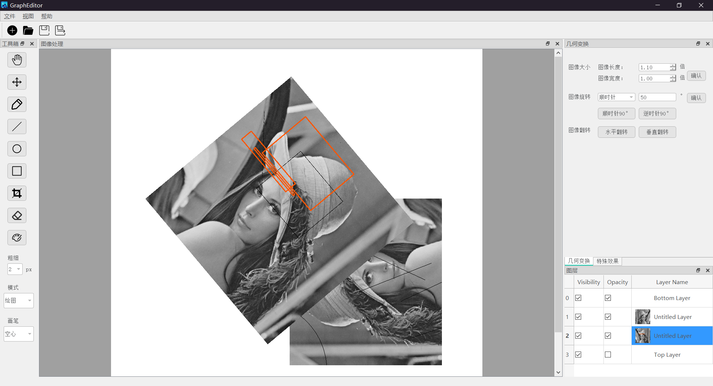

总报告
=============

# 1.问题及背景

本项目的目的是实现一个具有图层图像编辑功能的图像编辑器（迷你PS）,具体功能如下：
### 基本功能 
#### 具有图像大小调整、平移、缩放、旋转、分割功能； 
#### 能够显示直方图； 
#### 具有图像（圆、三角形、长方形）编辑功能； 
#### 图像文件的读取与保存。 

### 拓展功能 
#### 实现图像文件的新建、另存为、格式转换（BMP、PNG、JPG） 

#### 拓展基本功能中的图像编辑功能 
实现实心、空心图形 
实现粗细、颜色 
实现自由画笔 
实现多种模式橡皮擦 

#### 实现图层逻辑 
实现图层缩略图 
实现图层透明度、是否可视 
实现多个图层的叠加显示 

#### 实现多种图层滤镜 
可选滤镜程度 
实现多种图像滤波 
实现自定义软件布局 

# 2.开发计划和分工
线下多人协作，学习使用github,macdown,QT等软件，实现通过mvvm模式进行更高效率的团队开发。 
第一个星期，我们小组主要学习使用以上几种软件，并搭建程序的基本框架，并尝试添加图层旋转功能，进行ui设计。 
第二个星期，在搭建完程序框架后，我们的主要工作是实现更多的功能，并进一步完善我们的程序，进而消除我们团队协作过程中耦合的情况。 
具体分工：  
蓝锦青：提供程序设计总体思路和命题，完成UI界面设计，实现多个程序功能。 
袁青浩：搭建程序框架，实现几个基本类，对程序进行测试。 

# 3.每轮迭代效果说明：
第一轮迭代：蓝锦青完成ui界面设计，即完成所有按钮和菜单的设计，且无运行bug。 
两人共同商讨，由袁青浩完成图层类的设计并进行测试。 
第二轮迭代：蓝锦青完成QImageLabel类的设计，实现了ui槽与信号函数的连接， 
袁青浩完成图层组类的设计并进行测试。 
第三轮迭代：蓝锦青完成LayerDelegate类的设计，袁青浩完成了LayerTableModel类 
和LayerTableView类的设计。mvvm模型初步搭建。同时完成了第一个功能：打开/关闭图片 
第四轮迭代：蓝锦青实现LayerBasic类中的图像编辑函数，并和ui进行连接，添加了旋转/缩放/绘制等 
功能。袁青浩将添加图层/删除图层/选择图层等操作与ui进行连接。功能至此基本全部实现。 

# 4.最终运行效果图

